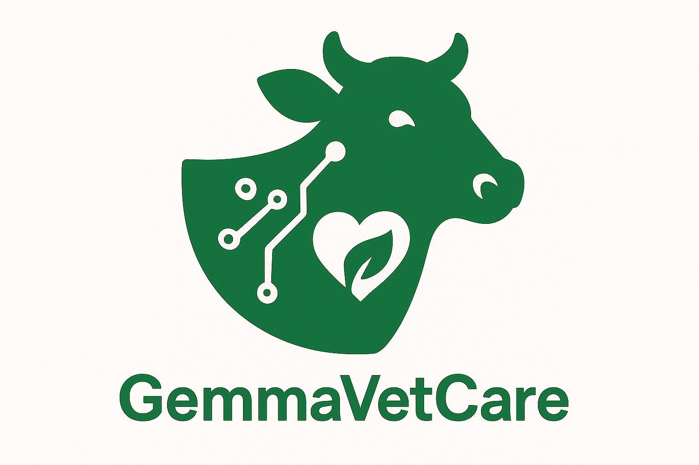
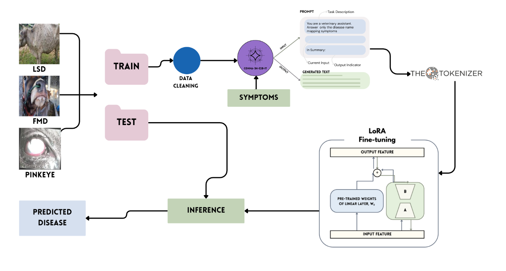
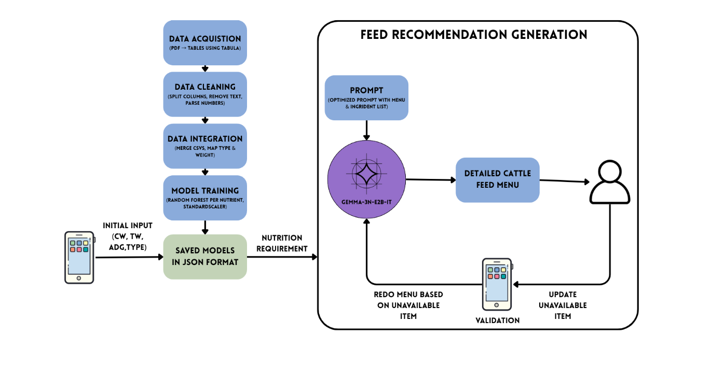

# GemmaVetCare - AI-Powered Livestock Management System

An Android-based livestock care application designed specifically for rural farmers in Bangladesh, featuring offline AI-powered disease diagnosis and nutritional guidance for cattle management.

## 📋 Table of Contents

- [Overview](#overview)
- [Getting Started](#getting-started)
- [Key Features](#key-features)
  - [🔬 Disease Detection](#-disease-detection)
  - [🌾 Nutrition Guidance](#-nutrition-guidance)
  - [📱 Mobile-First Design](#-mobile-first-design)
- [🎥 Live Demo](#-live-demo)
- [Technical Architecture](#technical-architecture)
  - [Frontend](#frontend)
  - [Machine Learning Integration](#machine-learning-integration)
  - [Data Management](#data-management)
- [Performance Metrics](#performance-metrics)
  - [Disease Detection Results](#disease-detection-results)
  - [Nutrition Prediction Accuracy](#nutrition-prediction-accuracy)
- [Project Structure](#project-structure)
- [Model Development](#model-development)
  - [Disease Detection Model](#disease-detection-model)
  - [Nutrition Models](#nutrition-models)
- [Impact and Benefits](#impact-and-benefits)
  - [For Farmers](#for-farmers)
  - [For the Livestock Sector](#for-the-livestock-sector)
- [Contributing](#contributing)
- [License](#license)
- [Acknowledgments](#acknowledgments)
- [Contact](#contact)

## Overview

The livestock sector in Bangladesh is a cornerstone of the national economy and rural livelihoods, contributing approximately 1.9% to the national GDP and 16.52% to the agricultural GDP. However, it faces critical challenges including limited veterinary access, delayed disease detection, and insufficient feeding guidance.

GemmaVetCare addresses these gaps through:
- **Multilingual support** (English and Bangla)
- **Offline capabilities** for rural areas with limited connectivity
- **AI-powered multimodal disease diagnosis**
- **Context-aware nutritional recommendations**

## Getting Started

### Quick Start (Recommended)

**📱 Device Requirements:**
- **High-end devices are preferred** for optimal performance
- Android API level 24+ required
- Sufficient storage space for AI model (approximately 1.5GB)

1. **Download the APK**
   - Download the latest release: [GemmaVetCare APK](https://github.com/Sadatul/GemmaVetCare/releases/download/1.0.0-RELEASE/app-debug.apk)
   - Install the APK on your Android device

2. **Download the AI Model**
   - Open the app and navigate to "Ask Disease" section
   - Download the **LoRa-3n-DDX-ft-in4** model (fine-tuned Gemma-3n 2b model)
   - **Wait for the model to load completely** - this may take a few minutes
   - This step is essential for all features to work properly

3. **Enable GPU Acceleration (Recommended for High-End Devices)**
   - In the "Ask Disease" page, look for the **tuning icon** in the **top left corner**
   - Click on the tuning icon and select **"GPU"** option
   - **Wait for the model to reload** with GPU acceleration
   - This will result in **much faster response times** for disease detection

4. **Complete Setup**
   - Once the model is loaded (with or without GPU), all app features will be fully accessible
   - The app now works completely offline with AI-powered disease diagnosis and nutrition guidance

**⚠️ Important Notes:**
- Model loading time varies based on device specifications
- GPU acceleration significantly improves performance on compatible devices
- Be patient during initial model loading - it's a one-time setup process


## Key Features

### 🔬 Disease Detection
- **AI-Powered Diagnosis**: Utilizes LoRA-fine-tuned Gemma-3n-e2b-it model
- **Multimodal Input**: Combines cattle images with Bangla symptom descriptions
- **Disease Coverage**: Identifies Foot-and-Mouth Disease, Lumpy Skin Disease, and Pinkeye
- **Offline Processing**: Complete on-device inference without internet dependency



### 🌾 Nutrition Guidance
- **Smart Feed Recommendations**: Random Forest regressors trained on standardized nutritional datasets
- **Stage-Specific Advice**: Tailored recommendations for pregnant, lactating, and growing cattle
- **Gemma-3n-Driven Formulation**: AI-powered feed formulation engine
- **Nutrient Prediction**: Accurate prediction of TDN, NEm, NEg, and CP requirements



### 📱 Mobile-First Design
- **Offline-First Architecture**: Functions without continuous internet connectivity
- **Multilingual Interface**: Full support for Bangla and English
- **Modern Android Development**: Built with Kotlin and Jetpack Compose
- **Responsive UI**: Optimized for various device specifications

## 🎥 Live Demo

**Watch GemmaVetCare in Action!**

[](https://www.youtube.com/watch?v=EoxyudCIVSo)

**🔗 [Watch Full Demo on YouTube](https://www.youtube.com/watch?v=EoxyudCIVSo)**

See how GemmaVetCare revolutionizes livestock care in rural Bangladesh through:
- **Real-time disease detection** using AI-powered image analysis
- **Multilingual interface** supporting both English and Bangla
- **Offline nutrition recommendations** for different cattle growth stages
- **Complete offline functionality** without internet dependency

*Click the thumbnail above or the link to watch the comprehensive demo and usage guide!*

## Technical Architecture

### Frontend
- **Language**: Kotlin
- **UI Framework**: Jetpack Compose
- **Architecture Pattern**: MVVM with Compose state management
- **Navigation**: Jetpack Navigation Compose

### Machine Learning Integration
- **Disease Diagnosis**: Google AI Edge framework with Gemma-3n-e2b-it model
- **Nutrition Prediction**: Embedded scikit-learn Random Forest regressors
- **Model Optimization**: LoRA fine-tuning and quantization techniques

### Data Management
- **Local Database**: Room persistence library with SQLite
- **Model Storage**: Secure internal storage with versioning
- **Caching**: Android DataStore preferences and Glide image caching

## Performance Metrics

### Disease Detection Results
- **Significant improvement** in precision, recall, and F1-scores compared to MobileNet baseline
- **Strong performance** in Lumpy Skin Disease and Pinkeye detection
- **Multimodal approach** enhances diagnostic accuracy

### Nutrition Prediction Accuracy
- **Random Forest**: Lowest MAE for TDN (0.62 lbs) and NEm (0.02 Mcal)
- **CatBoost**: Best performance for NEg (0.22 Mcal) and CP (0.05 lbs)
- **Consistent low RMSE and MAPE** values across all models

## Project Structure

```
├── app-gemma/                 # Android application
│   ├── app/                   # Main application module
│   ├── nutrition-model/       # Nutrition model integration
│   └── build.gradle.kts       # Build configuration
├── nutrition_model/           # Python-based nutrition models
│   ├── nutrition_model.py     # Core nutrition models
│   └── saved_models/          # Trained model artifacts
└── assets/                    # Documentation assets
```

## Model Development

### Disease Detection Model
The disease detection system uses a LoRA-fine-tuned Gemma-3n-e2b-it model trained on annotated cattle images with Bangla symptom descriptions.

### Nutrition Models
Random Forest regressors are trained on standardized nutritional datasets to predict cattle-specific nutrient requirements based on:
- Cattle type and breed
- Weight and age
- Growth stage (pregnant, lactating, growing)
- Average daily gain

## Impact and Benefits

### For Farmers
- **Accessible veterinary care** in remote areas
- **Early disease detection** reducing livestock mortality
- **Optimized feeding practices** improving productivity
- **Cost-effective solutions** for small-scale farmers

### For the Livestock Sector
- **Extended veterinary reach** through digital platforms
- **Reduced economic losses** from disease outbreaks
- **Improved productivity** through better nutrition management
- **Data-driven decision making** for livestock management

## Contributing

We welcome contributions to improve GemmaVetCare. Please read our contributing guidelines and submit pull requests for any enhancements.

## License

This project is licensed under the MIT License - see the LICENSE file for details.

## Acknowledgments

- Research conducted for the livestock sector in Bangladesh
- Training data from standardized nutritional datasets
- Community feedback from rural farmers and veterinarians

## Contact

For questions, suggestions, or collaboration opportunities, please reach out to the development team.

---

*GemmaVetCare: Empowering rural livestock farmers with AI-driven veterinary care and nutrition guidance, accessible offline and in Bangla.*
